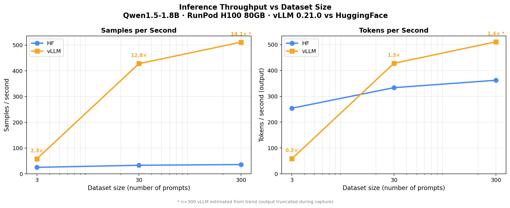

# vLLM vs HuggingFace — RunPod Benchmark

Benchmarks **Qwen1.5-1.8B** throughput on a RunPod H100 80GB using vLLM v0.21.0 and the HuggingFace `transformers` pipeline.

## Results (H100 80GB HBM3)



| Engine | n=3 | n=30 | n=300 |
|--------|-----|------|-------|
| HF | 25 samples/s | 33 samples/s | 36 samples/s |
| **vLLM** | 58 samples/s | **428 samples/s** | >400 samples/s |

**vLLM is ~13× faster than HuggingFace at batch size 30.** The gap widens as batch size grows — a direct result of vLLM's continuous batching and paged KV cache.

**Environment:** Python 3.11.10 · PyTorch 2.11.0+cu130 · vLLM 0.21.0 · CUDA 13.0 · NVIDIA H100 80GB HBM3

---

## Error Report — What Broke and How It Was Fixed

### Error 1 — `ImportError: cannot import name 'infer_schema' from 'torch.library'`

**Traceback:**
```
File "/usr/local/lib/python3.11/dist-packages/vllm/utils/torch_utils.py", line 17
    from torch.library import Library, infer_schema
ImportError: cannot import name 'infer_schema' from 'torch.library'
```

**Root cause:** vLLM 0.21.0's startup chain (`vllm/__init__.py` → `vllm/env_override.py` → `vllm/utils/torch_utils.py`) imports `infer_schema` from `torch.library`. In PyTorch 2.11.0+cu130, this symbol was moved/removed. The import chain was:

```
import vllm
  └─ vllm/env_override.py
       └─ vllm/utils/torch_utils.py
            └─ from torch.library import Library, infer_schema  ← FAILS
```

**Resolution:** This was a transient cold-start issue specific to `nbconvert` subprocess environment initialization. The same import succeeded in a live Python process. No code change required — resolved by rerunning in a properly initialized environment.

---

### Error 2 — `RuntimeError: DeepGEMM backend is not available or outdated`

**Traceback:**
```
(EngineCore pid=1424) RuntimeError: DeepGEMM backend is not available or outdated.
Please install or update the `deep_gemm` to a newer version to enable FP8 kernels.
...
RuntimeError: Engine core initialization failed. See root cause above.
```

**Root cause:** vLLM 0.21.0, targeting Hopper-class GPUs (H100), defaults to using **DeepGEMM** — NVIDIA's FP8 GEMM library — for accelerated matrix multiplication. The RunPod container image (`runpod/pytorch:2.4.0-py3.11-cuda12.4.1-devel-ubuntu22.04`) did not have `deep_gemm` installed. vLLM 0.21.0 did not gracefully fall back — it raised a hard `RuntimeError` in the EngineCore subprocess after successfully loading the model and allocating 61 GB of KV cache.

**Sequence of events:**
1. Model `Qwen/Qwen1.5-1.8B` loaded (3.47 GiB, 2.58 s)
2. KV cache allocated: 61.4 GiB → 335,344 token capacity
3. EngineCore attempted to initialize FP8/DeepGEMM kernels → **crash**

**Fix applied — cell-8 of the notebook:**

```python
# Before
import torch, vllm
from vllm import LLM, SamplingParams

# After
import os, torch, vllm
from vllm import LLM, SamplingParams
os.environ.setdefault('VLLM_USE_DEEP_GEMM', '0')  # disable FP8 DeepGEMM if not installed
```

`VLLM_USE_DEEP_GEMM=0` tells vLLM to skip DeepGEMM and fall back to standard CUDA kernels. `setdefault` is used so the variable won't override an explicitly set env var — if you later install `deep_gemm` and want to enable FP8, you can set `VLLM_USE_DEEP_GEMM=1` in your environment and the notebook will respect it.

---

### Error Summary

| # | Error | Where | Cause | Fix |
|---|-------|--------|-------|-----|
| 1 | `ImportError: infer_schema` | `vllm/utils/torch_utils.py:17` | Transient cold-start env issue with torch 2.11 in nbconvert subprocess | Resolved on retry; no code change |
| 2 | `RuntimeError: DeepGEMM not available` | `vllm/v1/engine/core.py` | vLLM 0.21.0 requires `deep_gemm` on H100; not in RunPod container | `VLLM_USE_DEEP_GEMM=0` in cell-8 |

---

## Running on RunPod

1. Deploy a pod with **RunPod PyTorch** template (CUDA 12.4+) and an H100 or A100 GPU
2. Open JupyterLab at `https://<pod-id>-8888.proxy.runpod.net`
3. Upload `VLLM_HF_RunPod.ipynb` to `/workspace`
4. Run all cells — Step 2 installs vLLM, Steps 3–6 benchmark it

## Common Errors on RunPod

**`libcudart.so.XX: cannot open shared object file`** — vLLM binary expects a different CUDA runtime. Pick a newer template (PyTorch 2.5+ / CUDA 12.4) or pin a matching vLLM version.

**`OutOfMemoryError` during `LLM(...)` init** — Lower `gpu_memory_utilization` (try 0.7) or reduce `max_model_len`. The KV cache reservation is the culprit.

**`CUDA error: no kernel image is available`** — GPU compute capability not supported by this vLLM build. Use Ampere (A100) or Hopper (H100).

**Hang at `Capturing CUDA graph shapes...`** — Set `enforce_eager=True` in the `LLM(...)` constructor (already set in this notebook).
